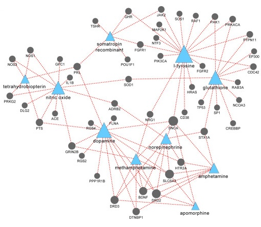

# Improving Drug-Gene Interaction Prediction with Learned Biomolecular Features


image source: [link](https://www.nature.com/articles/srep04176/figures/2)

### This repository is built upon the codebase from the following repository:
https://github.com/carpenter-singh-lab/motive

and the corresponding paper:
```
@article{arevalo2024motive,
  title={MOTIVE: A Drug-Target Interaction Graph For Inductive Link Prediction},
  author={Arevalo, John and Su, Ellen and Carpenter, Anne E and Singh, Shantanu},
  journal={arXiv preprint arXiv:2406.08649},
  year={2024}
}
```
